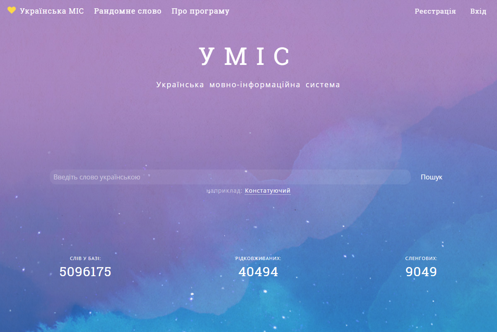
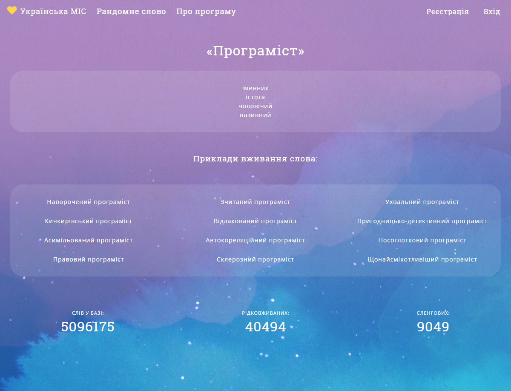

## Опис мовно-інформаційної системи

Завдання МІС полягає у наданні користувачам лексикографічної інформації про слова української мови, включаючи рідковживані та безпідставно занедбані слова. Часом наводяться й оказіоналізми: новотвори та слова-пропозиції.

Це мій внесок у розвиток української мови.

База даних містить: <b>5096175</b> українських слів. Серед них <b>40494</b> рідковживаних, та <b>9049</b> сленгових.

Алгоритм програми вміє підбирати випадкові епітети до слів. 

Наприклад, можна отримати прикметники для слова: ["програміст"](http://umis.salabun.com/word/3626819)

Посилання на проект: [http://umis.salabun.com/](http://umis.salabun.com/)

